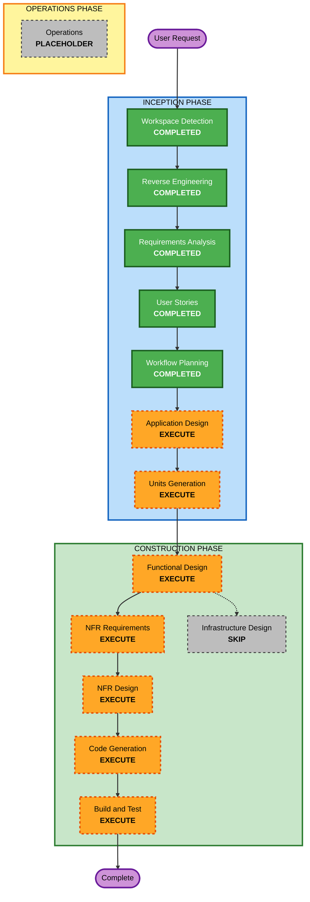

# Execution Plan: FIFA Elimination Prediction Poster

## Detailed Analysis Summary

### Transformation Scope

- **Transformation Type**: New user-facing feature inside an existing Next.js application.
- **Primary Changes**:
  - Add `/platform/elimination-prediction` route.
  - Add client-side bracket prediction workflow.
  - Add built-in FIFA team/flag data.
  - Add poster generation in square, story, and landscape formats.
  - Add download, native share, copy, X.com, and Facebook sharing controls.
  - Add English and Chinese route-level UI text.
- **Related Components**:
  - `app/layout.tsx` for existing shell consistency.
  - `app/platform/page.tsx` as the parent platform area.
  - New route files under `app/platform/elimination-prediction/`.
  - `public/` or colocated static assets for bundled flags/logos.
  - `package.json` for the proposed image generation dependency.

### Change Impact Assessment

- **User-facing changes**: Yes. A new interactive prediction tool is added.
- **Structural changes**: Yes. New route, client components, utility modules, and static assets are needed.
- **Data model changes**: Yes, local TypeScript models for participants, matchups, event details, and bracket prediction state.
- **API changes**: No v1 API route required because persistence is out of scope.
- **NFR impact**: Yes. Export reliability, responsive layout, accessibility, bilingual text fit, and build safety are important.

### Component Relationships

- **Primary Component**: `app/platform/elimination-prediction/`
- **Supporting Components**:
  - Bracket state and transition logic.
  - Poster export component.
  - Sharing/download utilities.
  - Local bilingual copy dictionary.
  - Static team data and flags/logos.
- **External Dependency**:
  - Proposed `html-to-image` for client-side PNG generation.
- **Backend/Infrastructure**:
  - No v1 backend, database, API, or storage change.

### Risk Assessment

- **Risk Level**: Medium.
- **Rollback Complexity**: Easy to moderate. The new feature is isolated under a new route, but package and asset changes must be reverted together if needed.
- **Testing Complexity**: Moderate. Bracket recalculation, poster dimensions, bilingual text fit, and browser sharing fallbacks need targeted verification.

## Workflow Visualization



### Text Alternative

```txt
Workspace Detection: completed
Reverse Engineering: completed
Requirements Analysis: completed
User Stories: completed
Workflow Planning: completed
Application Design: execute
Units Generation: execute
Functional Design: execute
NFR Requirements: execute
NFR Design: execute
Infrastructure Design: skip
Code Generation: execute
Build and Test: execute
Operations: placeholder
```

## Phases To Execute

### INCEPTION PHASE

- [x] Workspace Detection - Completed.
- [x] Reverse Engineering - Completed.
- [x] Requirements Analysis - Completed.
- [x] User Stories - Completed.
- [x] Workflow Planning - Completed.
- [ ] Application Design - EXECUTE
  - **Rationale**: New route, stateful client components, poster export, sharing utilities, and asset/data boundaries require component-level design.
- [ ] Units Generation - EXECUTE
  - **Rationale**: The feature has separable work units: bracket domain logic, interactive UI, poster generation, sharing, and localization/assets.

### CONSTRUCTION PHASE

- [ ] Functional Design - EXECUTE
  - **Rationale**: Bracket advancement and stale downstream recalculation are business rules that need detailed design.
- [ ] NFR Requirements - EXECUTE
  - **Rationale**: Responsive layout, accessibility, image export reliability, bilingual text fit, and build safety are meaningful quality requirements.
- [ ] NFR Design - EXECUTE
  - **Rationale**: Browser-only image generation and social sharing fallbacks need specific design patterns.
- [ ] Infrastructure Design - SKIP
  - **Rationale**: v1 is browser-only and requires no new backend, database, storage, networking, or deployment infrastructure.
- [ ] Code Generation - EXECUTE
  - **Rationale**: A new feature must be implemented in application code.
- [ ] Build and Test - EXECUTE
  - **Rationale**: The feature must pass build/lint verification and targeted functional checks.

### OPERATIONS PHASE

- [ ] Operations - PLACEHOLDER
  - **Rationale**: No AIDLC operations workflow is active for this project.

## Recommended Unit Breakdown

### Unit 1: Bracket Domain And Data

- Define participants, matchups, event details, prediction state, and poster format types.
- Provide default FIFA bracket data.
- Implement bracket creation, winner selection, downstream recalculation, reset, and champion resolution.

### Unit 2: Interactive Prediction UI

- Add route shell.
- Add bilingual UI controls.
- Render bracket editor.
- Support event detail editing.
- Support responsive layout and accessible controls.

### Unit 3: Poster Generation

- Build export-only poster component.
- Support square, story, and landscape dimensions.
- Render bracket, flags/logos, champion, final details, and branding.
- Generate PNG from the export component.

### Unit 4: Sharing And Download

- Download generated PNG.
- Trigger native share where supported.
- Copy share text or page URL.
- Open X.com and Facebook share actions.
- Provide fallback behavior for unsupported platforms.

## Package Change Sequence

1. Add types, data, and bracket logic.
2. Add route and interactive prediction UI.
3. Add static assets or asset references for flags/logos.
4. Add poster export component and PNG generation dependency.
5. Add sharing/download utilities.
6. Add focused tests or verification scripts where feasible.
7. Run lint/build and browser verification.

## Estimated Timeline

- **Total Remaining Stages**: 7 executable stages plus one skipped infrastructure stage.
- **Estimated Duration**: Moderate. Implementation can be done in one feature slice, but AIDLC design artifacts should precede code generation.

## Success Criteria

- Requirements and stories trace to implementation units.
- The new route works in the existing Next.js application.
- Users can complete a FIFA knockout bracket manually.
- Bracket recalculation prevents stale downstream selections.
- Users can generate all three poster formats.
- Posters include built-in flags/logos, champion, final details, and Hobite branding.
- Users can download, native share where supported, copy, and use X.com/Facebook actions.
- English and Chinese UI are supported.
- The feature builds successfully with `npm run build`.

